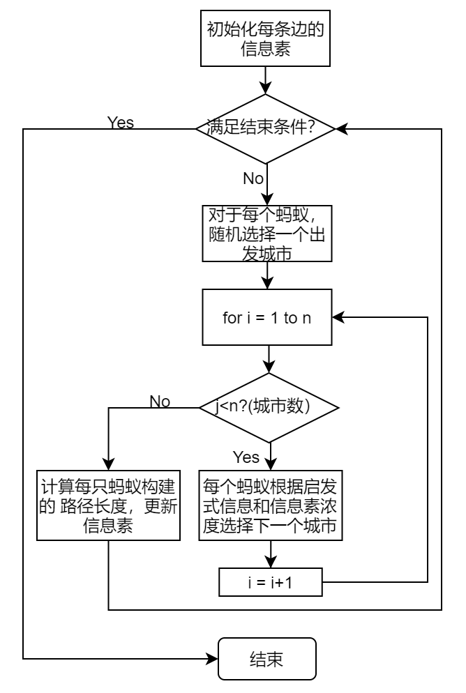
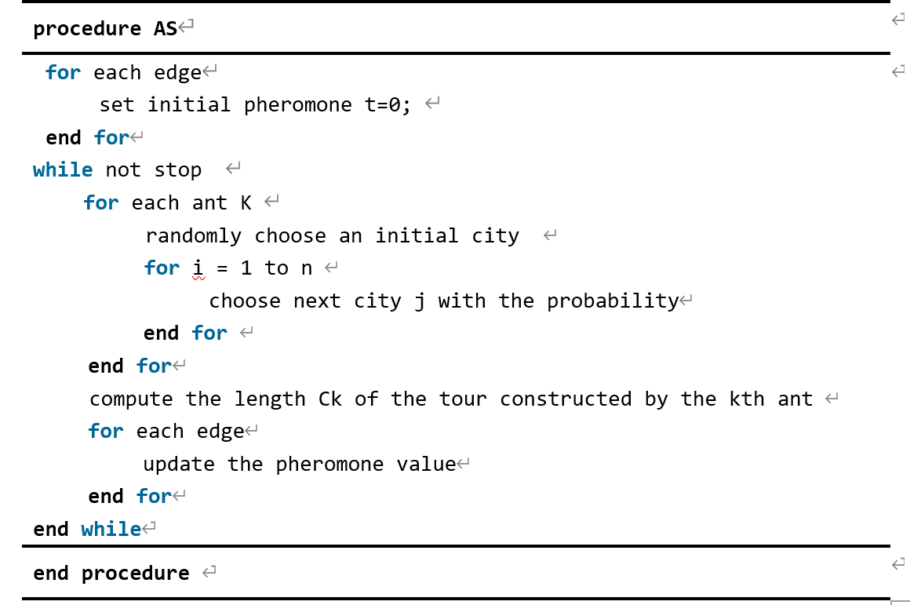
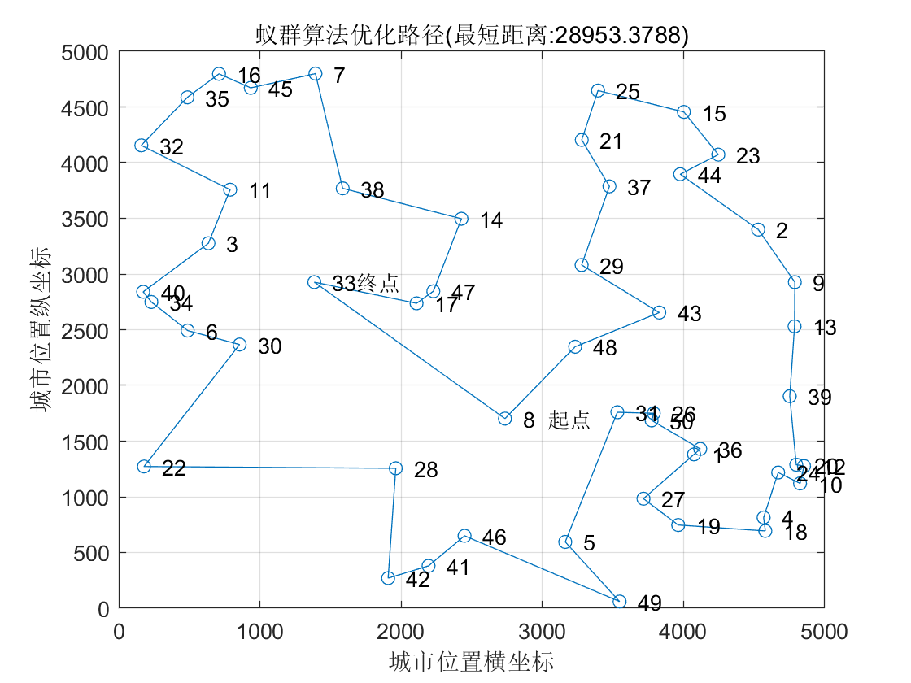
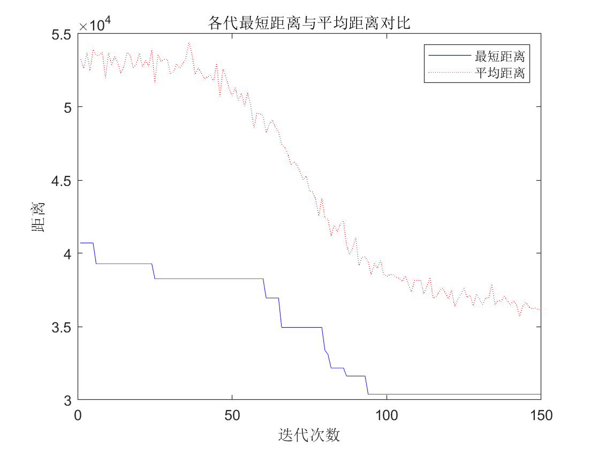
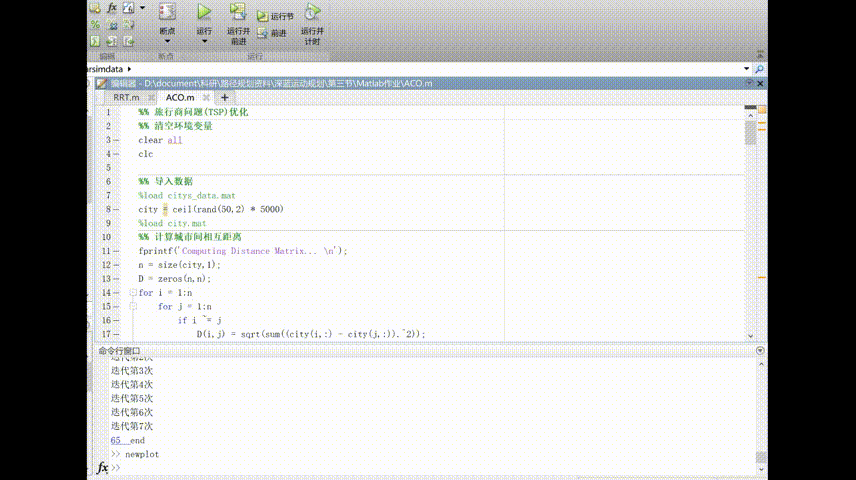

基于蚁群(ACO，ant colony optimization)算法的旅行商问题(TSP)的程序框图、伪代码及matlab仿真实现。程序框图如图所示。

实现了基于matlab的ACO算法仿真，实现了对旅行商问题的求解，通过150次迭代使得总路径逐渐收敛到最优，并对结果进行了输出显示。下图显示了迭代求解时路径变化的全过程。此外，基于上文的分析，蚁群算法中信息素浓度、挥发因子、启发函数因子等因素均会对算法效果产生极大影响，在开发中验证了各个参数对算法的影响效果。

在实车上进行了基于Ros机器人操作系统和C++的软件开发工作，将基于ACO算法的快速搜索搜救任务决策系统部署在实车及虚拟节点上，并由中心下发指令给各车，各车按照自身分配的任务点分别执行任务，从而实现快速搜索任务。为达到总路径最短的最优效果，软件通过1500次以上迭代路径总代价不变为指标，保证了全局路径的最优，能够实现最快遍历目的。下图为实际运算结果，左图为根据当前地图及任务点的位置，根据当前车辆数量，规划出实际可行的全局路线；右图分别为算法迭代次数、路径总代价、各车需要执行的任务点编号信息。

.jpg)

运行方法 rosrun aco_planner aco_planner_talker 发送路点

rosrun aco_planner aco_planner_node 计算最优路径

rosrun acoudp aco_server_node 通过udp发送路点给各车

在车上启动 rosrun acoudp aco_client_node 接收路点

